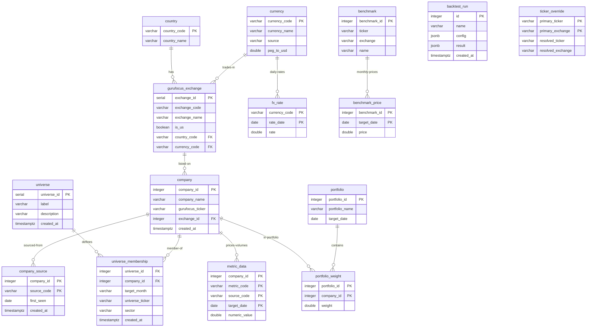

# Database Schema

```mermaid
erDiagram
    country {
        varchar country_code PK
        varchar country_name
    }

    currency {
        varchar currency_code PK
        varchar currency_name
        varchar source
        double peg_to_usd
    }

    gurufocus_exchange {
        serial exchange_id PK
        varchar exchange_code
        varchar exchange_name
        boolean is_us
        varchar country_code FK
        varchar currency_code FK
    }

    company {
        integer company_id PK
        varchar company_name
        varchar gurufocus_ticker
        integer exchange_id FK
        timestamptz created_at
    }

    company_source {
        integer company_id PK
        varchar source_code PK
        date first_seen
        timestamptz created_at
    }

    universe {
        serial universe_id PK
        varchar label
        varchar description
        timestamptz created_at
    }

    universe_membership {
        integer universe_id FK
        integer company_id FK
        varchar target_month
        varchar universe_ticker
        varchar sector
        timestamptz created_at
    }

    metric_data {
        integer company_id PK
        varchar metric_code PK
        varchar source_code PK
        date target_date PK
        double numeric_value
    }

    fx_rate {
        varchar currency_code PK
        date rate_date PK
        double rate
    }

    portfolio {
        integer portfolio_id PK
        varchar portfolio_name
        date target_date
    }

    portfolio_weight {
        integer portfolio_id PK
        integer company_id PK
        double weight
    }

    benchmark {
        integer benchmark_id PK
        varchar ticker
        varchar exchange
        varchar name
    }

    benchmark_price {
        integer benchmark_id PK
        date target_date PK
        double price
    }

    backtest_run {
        integer id PK
        varchar name
        jsonb config
        jsonb result
        timestamptz created_at
    }

    ticker_override {
        varchar primary_ticker PK
        varchar primary_exchange PK
        varchar resolved_ticker
        varchar resolved_exchange
    }

    country ||--o{ gurufocus_exchange : "has"
    currency ||--o{ gurufocus_exchange : "trades-in"
    currency ||--o{ fx_rate : "daily-rates"
    gurufocus_exchange ||--o{ company : "listed-on"
    company ||--o{ company_source : "sourced-from"
    universe ||--o{ universe_membership : "defines"
    company ||--o{ universe_membership : "member-of"
    company ||--o{ metric_data : "prices-volumes"
    company ||--o{ portfolio_weight : "in-portfolio"
    portfolio ||--o{ portfolio_weight : "contains"
    benchmark ||--o{ benchmark_price : "monthly-prices"
```
